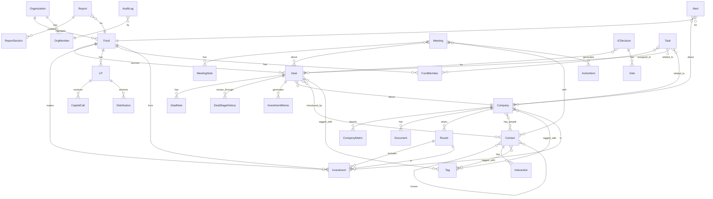

## Enhancement Summary

**Deepened on:** 2026-03-20
**Sections enhanced:** 11
**Research agents used:** architecture-strategist, security-sentinel, performance-oracle, agent-native-reviewer, data-integrity-guardian, framework-docs-researcher, best-practices-researcher, kieran-typescript-reviewer

### Key Improvements
1. **Data model hardened** — Added missing entities (Round, Investment, Tag), proper junction tables, tenant isolation via RLS
2. **Security architecture strengthened** — Row-Level Security, AI data sanitization, LP portal zero-trust, audit logging
3. **AI agent architecture refined** — Tool registry pattern, approval workflows, cross-module orchestration
4. **Performance strategy detailed** — Index plan, caching layers, streaming patterns, dashboard optimization
5. **TypeScript architecture** — Schema-derived types, branded IDs, result monads, Zod integration

### New Considerations Discovered
- Need Row-Level Security (RLS) in Neon for multi-tenant data isolation, not just application-level filtering
- AI agents must sanitize financial data before sending to LLMs — no raw LP PII in prompts
- Network graph needs incremental loading (not full graph render) for 1000+ contacts
- CompanyMetric needs a time-series approach with materialized views for dashboard performance
- Investment memo generation needs DurableAgent (Workflow DevKit) — it's a long-running, multi-step process

---

# AI-Native VC Project Management Platform

## Overview

Build a project management platform purpose-built for small-to-medium Venture Capital firms (managing $50M–$500M AUM, 2–15 person teams). The platform is **AI-native** — meaning AI is not a feature layer on top of traditional CRUD, but the primary interaction paradigm. Every workflow (deal evaluation, portfolio monitoring, LP reporting, team coordination) is designed around AI agents that draft, analyze, and surface insights proactively.

**Product Name (working):** VentureMind

**Target Users:**
- GP / Managing Partners — investment decisions, LP relations
- Associates / Analysts — deal sourcing, due diligence, memo writing
- Operations / Back-office — fund admin, reporting, compliance
- LPs (read-only portal) — performance reports, capital call notices

### Research Insights: AI-Native UX Paradigm

**What "AI-native" means (vs. AI-augmented):**
- **AI-augmented**: Traditional CRUD UI + "Ask AI" button bolted on. User drives all actions. AI is a feature.
- **AI-native**: AI is the primary interaction surface. The system proactively surfaces work, drafts outputs, and routes decisions. Forms exist as structured fallback, not primary input.

**Patterns from successful AI-native products:**
- **Cursor** — AI writes code, human reviews. The AI proposes, human disposes. Apply to: AI drafts memos, human reviews.
- **Linear** — AI triages and routes issues automatically. Apply to: AI routes deals to right partner based on thesis fit.
- **Notion AI** — AI understands document context and can transform content. Apply to: AI understands deal context across all related entities.

**Key UX principle**: Every screen should have an AI affordance. Not a chatbot, but contextual AI actions: "Summarize this deal", "Draft LP update for this company", "Find similar deals we passed on."

## Problem Statement

Small-to-medium VC firms operate with lean teams but face the same complexity as large funds:

1. **Deal flow chaos** — Deals come from email, WeChat, LinkedIn, referrals. No single source of truth. Associates spend 40%+ time on data entry.
2. **Memo & DD drudgery** — Investment memos take 4-8 hours to draft. Due diligence checklists are tracked in scattered Google Docs.
3. **Portfolio black holes** — Portfolio companies report metrics inconsistently. Partners lack real-time health visibility. Problems surface too late.
4. **LP reporting pain** — Quarterly reports take 2-3 weeks to assemble. Data comes from 5+ sources. Formatting is manual.
5. **Relationship entropy** — The network is the fund's moat, but relationship data lives in individual heads and inboxes.
6. **Tool fragmentation** — Teams use Airtable + Google Sheets + Notion + email + WeChat. No integration, no automation.

### Competitive Landscape

| Product | Strength | Weakness | AI Status |
|---------|----------|----------|-----------|
| **Edda (Kushim)** | End-to-end platform, 160+ firms, $170B+ AUM | Enterprise pricing, limited AI | AI-augmented (basic) |
| **Affinity** | Relationship intelligence, auto-CRM | Not VC-specific, no portfolio mgmt | AI for relationship scoring |
| **4Degrees** | Network mapping, warm intros | Limited portfolio features | Basic AI suggestions |
| **DealCloud** | Enterprise PE/VC, deep customization | Very expensive, complex setup | Minimal AI |
| **Standard Metrics** | Best-in-class portfolio reporting, 9000+ companies | Reporting-only, no deal flow | AI Analyst (NLP queries), MCP server |
| **Visible** | LP reporting + fundraising | Limited deal flow | Basic analytics |
| **Attio** | Modern CRM, flexible data model | Generic, not VC-specific | AI search |
| **Carta** | Cap table, fund admin | Admin-focused, not workflow | Minimal |

**Our Differentiation:** No existing tool is truly AI-native. They bolt AI onto traditional form-based CRUD interfaces. VentureMind makes AI the primary interaction layer — you talk to it, it drafts, you review. The UI is a conversation-first workspace, not a database with chat bolted on.

## Proposed Solution

### AI-Native Design Principles

1. **Conversation-first, not form-first** — Every entity (deal, company, contact) can be created, updated, and queried through natural language. Forms exist as structured fallback, not primary input.
2. **AI drafts, human decides** — Investment memos, LP reports, portfolio summaries are AI-drafted from structured data. Humans review, edit, and approve — never start from blank page.
3. **Proactive intelligence** — The system surfaces insights without being asked: "Company X's burn rate increased 40% — runway is now 8 months" or "You haven't followed up with Deal Y in 14 days."
4. **Context-aware agents** — Each workflow has a specialized AI agent that understands the domain (deal evaluation criteria, portfolio metrics standards, LP communication tone).
5. **Network as knowledge graph** — Relationships between people, companies, funds, and deals form a queryable graph that powers warm intro suggestions and deal sourcing.

### Research Insights: Conversation-First Architecture

**Pattern: Command Palette + Contextual AI**
Instead of only a chat sidebar, implement a dual-mode AI interface:
- **Chat sidebar** — For open-ended queries, multi-step workflows, exploration
- **Command palette** (Cmd+K) — For quick actions: "new deal", "score deal X", "draft memo for Y"
- **Inline AI** — Context-sensitive AI buttons on every entity card: summarize, compare, draft

**Pattern: AI Output Review Flow**
```
AI generates → Preview with diff/highlights → Human edits → Approve/Reject → Save
```
Every AI output goes through a review stage. Never auto-publish AI content to LPs or external parties.

### Core Modules (9 Specs)

| # | Module | Description | AI Integration |
|---|--------|-------------|----------------|
| 1 | **Foundation & Auth** | Next.js app shell, auth, roles, multi-fund | Clerk auth, role-based AI permissions |
| 2 | **Data Model & API** | Core entities, Neon Postgres, API layer | Schema design, API routes |
| 3 | **Deal Flow Pipeline** | Kanban pipeline, deal intake, evaluation | AI deal scoring, auto-categorization |
| 4 | **AI Memo & DD Engine** | Investment memo generation, DD checklists | Structured output, document AI |
| 5 | **Portfolio Dashboard** | Company tracking, metrics, health scoring | Anomaly detection, trend analysis |
| 6 | **LP Portal & Reporting** | LP-facing portal, quarterly report gen | AI report drafting, data assembly |
| 7 | **Contact CRM & Network Graph** | Relationship management, intro paths | Network analysis, warm intro AI |
| 8 | **Meeting & Document AI** | Meeting notes, pitch deck analysis | Summarization, entity extraction |
| 9 | **Team Workspace & IC Flow** | Tasks, IC process, approvals, notifications | AI task routing, decision support |

## Technical Approach

### Architecture

```
┌─────────────────────────────────────────────────────────┐
│                    Frontend (Next.js 16)                  │
│  ┌──────────┐ ┌──────────┐ ┌──────────┐ ┌────────────┐ │
│  │ AI Chat  │ │Dashboard │ │ Pipeline │ │  LP Portal │ │
│  │ Sidebar  │ │  Views   │ │  Kanban  │ │  (Public)  │ │
│  └────┬─────┘ └────┬─────┘ └────┬─────┘ └─────┬──────┘ │
│       │             │            │              │        │
│  ┌────┴─────────────┴────────────┴──────────────┴────┐  │
│  │      AI Elements + AI SDK v6 (useChat)             │  │
│  │      + Command Palette (Cmd+K)                     │  │
│  └────────────────────────┬──────────────────────────┘  │
└───────────────────────────┼──────────────────────────────┘
                            │ SSE/Streaming
┌───────────────────────────┼──────────────────────────────┐
│                  Backend (Vercel Functions)               │
│  ┌────────────┐ ┌────────┴───────┐ ┌──────────────────┐ │
│  │ API Routes │ │  AI Agents     │ │  Background Jobs  │ │
│  │ (CRUD)     │ │  (Agent class) │ │  (Vercel Queues)  │ │
│  │            │ │  + DurableAgent│ │  + Cron Jobs      │ │
│  └─────┬──────┘ └────────┬───────┘ └────────┬─────────┘ │
│        │                 │                   │           │
│  ┌─────┴─────────────────┴───────────────────┴────────┐  │
│  │              Service Layer (Repository Pattern)     │  │
│  │  DealService │ PortfolioService │ ReportService     │  │
│  │  ContactService │ MemoService │ MeetingService      │  │
│  └──────────────────────┬─────────────────────────────┘  │
└─────────────────────────┼────────────────────────────────┘
                          │
┌─────────────────────────┼────────────────────────────────┐
│                   Data Layer                              │
│  ┌──────────┐  ┌────────┴──────┐  ┌───────────────────┐ │
│  │  Neon    │  │  AI Gateway   │  │  Vercel Blob      │ │
│  │ Postgres │  │  (OIDC auth)  │  │  (docs, decks)    │ │
│  │  + RLS   │  │  model routing│  │                   │ │
│  │  +pgvector│ └───────────────┘  └───────────────────┘ │
│  └──────────┘  ┌───────────────┐  ┌───────────────────┐ │
│  ┌──────────┐  │  Edge Config  │  │  Vercel Queues    │ │
│  │ Upstash  │  │  (flags)      │  │  (async jobs)     │ │
│  │ Redis    │  └───────────────┘  └───────────────────┘ │
│  └──────────┘                                            │
└──────────────────────────────────────────────────────────┘
```

### Research Insights: Architecture Improvements

**1. Repository Pattern for Data Access**
Wrap all Drizzle queries behind repository interfaces. This enables:
- Automatic tenant filtering (fund_id injected at repository level)
- Consistent audit trail logging
- Easy mocking for tests
- Cache layer insertion without touching service code

**2. Row-Level Security (RLS) in Neon**
Application-level `WHERE fund_id = ?` is insufficient for a multi-tenant financial platform. Use Postgres RLS:
```sql
-- Set current tenant context
SET app.current_fund_id = 'fund_xxx';

-- RLS policy on every tenant table
CREATE POLICY tenant_isolation ON deals
  USING (fund_id = current_setting('app.current_fund_id')::uuid);
```
This provides defense-in-depth: even if application code has a bug, the database won't leak cross-tenant data.

**3. Event-Driven Architecture for Proactive Intelligence**
The "proactive intelligence" principle requires an event system:
```
Entity change → Event emitted → Queue → AI evaluation → Alert if significant
```
Use Vercel Queues as the event bus. When a CompanyMetric is updated, emit an event. A consumer evaluates if the change is significant (anomaly detection) and creates alerts.

### Data Model (ERD)



### Research Insights: Data Model Improvements

**1. Missing Entities Added:**
- **Organization** — Top-level tenant (maps to Clerk org). A management company can manage multiple funds.
- **Round** — Tracks funding rounds (Seed, Series A, etc.) independent of our investment. A Company has Rounds; an Investment links Fund→Round→Company.
- **Investment** — Separate from Deal. A Deal is a pipeline item; an Investment is a completed transaction with amount, date, ownership %, valuation.
- **Tag** — Polymorphic tagging system for Deals, Companies, Contacts. Enables custom categorization.
- **ActionItem** — Extracted from meetings, distinct from Tasks (action items are AI-generated, tasks are human-created).
- **Alert** — AI-generated alerts (anomalies, follow-up reminders, milestone events).
- **AuditLog** — Immutable audit trail for compliance.

**2. Key Schema Improvements:**
- **DealStageHistory** (not DealStage) — Track stage transitions with timestamps, not just current stage. Enables pipeline velocity metrics.
- **CompanyMetric** needs composite index: `(company_id, metric_type, period)` with `UNIQUE` constraint to prevent duplicate entries.
- **Vector columns**: `embedding vector(1536)` on Company.description and Contact.bio for semantic search via pgvector.
- **Soft delete**: Use `deleted_at TIMESTAMP` (not boolean) on all entities. Enables "deleted within last 30 days" recovery.
- **Audit fields**: `created_by UUID, updated_by UUID, created_at TIMESTAMPTZ, updated_at TIMESTAMPTZ` on every table.

**3. Multi-Tenancy Strategy:**
```
Organization (Clerk org)
  └── Fund (tenant boundary for data)
       └── All data scoped to fund_id
```
- `fund_id` on every tenant-scoped table
- RLS policies enforce isolation at database level
- Cross-fund queries (org-level dashboards) use explicit `fund_id IN (...)` with org membership check

### Key Entities

| Entity | Description | Key Fields |
|--------|-------------|------------|
| **Organization** | Management company (Clerk org) | name, slug, plan, settings |
| **Fund** | Investment vehicle | org_id, name, vintage, size, strategy, status |
| **Company** | Any company (prospect or portfolio) | name, sector, stage, location, description, embedding |
| **Deal** | Investment opportunity in pipeline | fund_id, company_id, stage, amount, lead_partner, source, score |
| **Round** | Funding round | company_id, type, amount, date, valuation, lead_investor |
| **Investment** | Completed investment | fund_id, company_id, round_id, amount, ownership_pct, date |
| **Contact** | Person in network | name, title, company_id, relationship_strength, embedding |
| **LP** | Limited partner | fund_id, name, type, commitment, contact_info |
| **InvestmentMemo** | AI-generated memo | deal_id, template_id, sections_json, status, version |
| **CompanyMetric** | KPI data point | company_id, metric_type, value, period, source |
| **Report** | LP/internal report | fund_id, type, period, sections, status |
| **Meeting** | Meeting record | participants, date, deal_id, summary, recording_url |
| **Task** | Action item | assignee_id, due_date, entity_type, entity_id, status |
| **ICDecision** | Investment committee decision | deal_id, outcome, conditions, date |
| **Tag** | Entity tag | name, color, entity_type |
| **Alert** | AI-generated alert | fund_id, entity_type, entity_id, severity, message, read |
| **AuditLog** | Immutable audit trail | org_member_id, action, entity_type, entity_id, diff_json |

### Tech Stack

| Layer | Technology | Rationale |
|-------|------------|-----------|
| Framework | Next.js 16 (App Router) | Server Components, streaming, proxy.ts |
| UI | shadcn/ui + Geist + AI Elements | Design system, AI chat components |
| Auth | Clerk (Vercel Marketplace) | Multi-tenant, org support, RBAC |
| Database | Neon Postgres + pgvector + RLS | Serverless, branching, vector search, tenant isolation |
| ORM | Drizzle ORM | Type-safe, schema-first, migration support |
| Cache | Upstash Redis | Session, rate limiting, real-time, AI response cache |
| File Storage | Vercel Blob | Pitch decks, documents, reports (up to 5TB) |
| AI | AI Gateway (OIDC) + AI SDK v6 | Model routing, no API keys, streaming |
| Background Jobs | Vercel Queues | Portfolio metric collection, report gen, alerts |
| Feature Flags | Edge Config + Vercel Flags | Gradual rollout, per-fund feature control |
| Observability | Vercel Analytics + Speed Insights | Performance monitoring, Core Web Vitals |
| Deployment | Vercel Platform | Preview URLs, CI/CD, zero-config |

### Research Insights: Tech Stack Additions

**1. Drizzle ORM Type-Safe Patterns:**
```typescript
// Schema-derived types (single source of truth)
import { deals } from '@/db/schema';
import { InferSelectModel, InferInsertModel } from 'drizzle-orm';

type Deal = InferSelectModel<typeof deals>;
type NewDeal = InferInsertModel<typeof deals>;

// Branded IDs for type safety
type DealId = string & { readonly __brand: 'DealId' };
type FundId = string & { readonly __brand: 'FundId' };
type CompanyId = string & { readonly __brand: 'CompanyId' };
```

**2. API Response Envelope:**
```typescript
type ApiResponse<T> =
  | { success: true; data: T; meta?: PaginationMeta }
  | { success: false; error: string; code: string };
```

**3. AI Tool Schema Pattern (AI SDK v6):**
```typescript
import { z } from 'zod';
import { tool } from 'ai';

const scoreDeal = tool({
  description: 'Score a deal on market, team, traction, and fund fit',
  inputSchema: z.object({
    dealId: z.string().describe('The deal ID to score'),
    criteria: z.array(z.enum(['market', 'team', 'traction', 'fit'])).optional(),
  }),
  outputSchema: z.object({
    scores: z.record(z.number().min(0).max(100)),
    overall: z.number().min(0).max(100),
    reasoning: z.string(),
  }),
  execute: async ({ dealId, criteria }) => { /* ... */ },
});
```

### AI Agent Architecture

```
┌──────────────────────────────────────────────┐
│            AI Gateway (OIDC auth)              │
│  anthropic/claude-sonnet-4.6  (default)       │
│  google/gemini-3.1-flash      (fast tasks)    │
│  anthropic/claude-opus-4.6    (deep analysis) │
└────────────────┬─────────────────────────────┘
                 │
    ┌────────────┼──────────────┐
    │            │              │
┌───┴────┐ ┌────┴─────┐ ┌─────┴─────┐
│ Deal   │ │Portfolio │ │ Report    │
│ Agent  │ │ Agent    │ │ Agent     │
│        │ │          │ │(Durable)  │
│ Tools: │ │ Tools:   │ │ Tools:    │
│-create │ │-getMetric│ │-queryData │
│-score  │ │-setHealth│ │-formatSec │
│-memo   │ │-anomaly  │ │-genChart  │
│-compare│ │-benchmark│ │-draftText │
│-enrich │ │-alert    │ │-exportPDF │
└────────┘ └──────────┘ └───────────┘
    │            │              │
┌───┴────┐ ┌────┴─────┐ ┌─────┴─────┐
│Network │ │ Meeting  │ │  Triage   │
│ Agent  │ │ Agent    │ │  Agent    │
│        │ │          │ │           │
│ Tools: │ │ Tools:   │ │ Tools:    │
│-findPath│ │-summarize│ │-classify  │
│-suggest│ │-extract  │ │-route     │
│-enrich │ │-parseDeck│ │-prioritize│
│-score  │ │-linkEntity││-briefing  │
└────────┘ └──────────┘ └───────────┘
```

### Research Insights: AI Agent Improvements

**1. Tool Registry Pattern**
Instead of hardcoding tools per agent, use a dynamic tool registry:
```typescript
// Each service registers its tools
const toolRegistry = new ToolRegistry();
toolRegistry.register('deal', [createDeal, scoreDeal, compareDeal, enrichDeal]);
toolRegistry.register('portfolio', [getMetrics, setHealth, detectAnomaly]);

// Agent gets tools based on context
const dealAgent = new Agent({
  model: 'anthropic/claude-sonnet-4.6',
  instructions: dealAgentPrompt,
  tools: toolRegistry.getTools(['deal', 'company', 'contact']),
});
```

**2. DurableAgent for Memo Generation**
Investment memo generation is a long-running, multi-step process (gather data → analyze → draft sections → assemble). Use Workflow DevKit DurableAgent:
```typescript
import { DurableAgent } from '@workflow/ai/agent';

const memoAgent = new DurableAgent({
  model: 'anthropic/claude-sonnet-4.6',
  instructions: memoAgentPrompt,
  tools: [gatherDealData, analyzeMarket, draftSection, assembleMemo],
  stopWhen: stepCountIs(20),
});
```

**3. Human-in-the-Loop Approval**
For sensitive outputs (LP reports, external communications), use Workflow DevKit hooks:
```typescript
const approvalHook = defineHook('approval');
// In workflow: pause and wait for human approval
await approvalHook.pause({ content: draftReport, requiredRole: 'partner' });
// Resume when partner approves in UI
```

**4. AI Data Sanitization**
Before sending financial data to LLMs, sanitize:
- Remove LP names and contact details from context
- Use anonymized identifiers in prompts
- Never include raw bank account or wire info
- Log all AI prompts containing financial data to audit trail

**5. Triage Agent (New)**
Add a "Triage Agent" that acts as the router for the command palette and chat sidebar:
- Classifies user intent → routes to appropriate domain agent
- Handles multi-domain queries by orchestrating multiple agents
- Generates daily briefings by querying all domain agents

**Model Routing Strategy:**
| Task Type | Model | Rationale | Cost |
|-----------|-------|-----------|------|
| Classification, extraction, scoring | `google/gemini-3.1-flash` | Fast, cheap, sufficient accuracy | ~$0.001/request |
| Memo drafting, summaries, chat | `anthropic/claude-sonnet-4.6` | Best coding + writing balance | ~$0.01/request |
| IC decision support, market analysis | `anthropic/claude-opus-4.6` | Deepest reasoning | ~$0.10/request |
| Document OCR/parsing | `google/gemini-3.1-flash` | Multimodal, fast | ~$0.002/request |

**AI Cost Estimation (per fund, per month):**
- ~500 deal scoring requests × $0.001 = $0.50
- ~100 memo sections × $0.01 = $1.00
- ~50 chat interactions × $0.01 = $0.50
- ~10 deep analysis × $0.10 = $1.00
- **Total: ~$3-5/fund/month** (very affordable)

## Implementation Phases

### Phase 1: Foundation (Specs 1-2) — Week 1-2

**Spec 1: Foundation & Auth**
- Next.js 16 project scaffold (single app, not Turborepo — keep simple until needed)
- Clerk auth with org/fund multi-tenancy
- Role system: Admin, Partner, Associate, Analyst, LP (read-only)
- Dark-mode dashboard shell with shadcn/ui + Geist
- Layout: collapsible sidebar nav + main content + AI chat panel (resizable)
- AI chat sidebar using AI Elements `<Conversation>` + `<Message>` components
- Command palette (Cmd+K) with AI-powered search
- proxy.ts for auth middleware (Clerk `clerkMiddleware()`)
- Base layout with TooltipProvider, ThemeProvider at root

### Research Insights: Foundation
- **Clerk gotcha**: After sign-in, if user has no org, `auth()` returns `{ userId, orgSlug: null }`. Must handle with redirect to org creation page.
- **proxy.ts location**: Place at same level as `app/` (project root or inside `src/` if using src-dir).
- **Dark mode**: Set `className="dark"` on `<html>`, use CSS variables with oklch colors.
- **Layout structure**: Use `<ResizablePanelGroup>` from shadcn/ui for the sidebar + main + AI panel layout.

**Spec 2: Data Model & API**
- Neon Postgres schema with Drizzle ORM
- All entities with migrations (16 core + junction tables)
- Row-Level Security policies for tenant isolation
- REST API routes (CRUD) for all entities using Route Handlers
- Soft delete (`deleted_at`), audit trail (`created_by`, `updated_by`, `created_at`, `updated_at`)
- Vector columns on Company and Contact for semantic search (pgvector)
- API response envelope pattern with proper error types
- Zod schemas for all input validation
- Repository pattern: `DealRepository`, `CompanyRepository`, etc.
- Seed script with demo data (anonymized)

### Research Insights: Data Model
- **pgvector setup**: Use `CREATE EXTENSION vector;` in Neon. Index with `ivfflat` for <100K rows, `hnsw` for larger datasets.
- **CompanyMetric optimization**: Create a materialized view `company_latest_metrics` that pre-aggregates latest metric per type per company. Refresh on metric insert via trigger or queue.
- **Drizzle + Neon**: Use `@neondatabase/serverless` driver with Drizzle's `drizzle-orm/neon-serverless` adapter.
- **Migration strategy**: Use `drizzle-kit push` for dev, `drizzle-kit generate` + `drizzle-kit migrate` for production.

### Phase 2: Core Workflows (Specs 3-5) — Week 3-5

**Spec 3: Deal Flow Pipeline**
- Kanban board (configurable stages: Sourced → Screening → DD → IC → Term Sheet → Closed/Passed)
- Drag-and-drop with `@dnd-kit` (accessible, performant)
- Deal intake via AI chat: "Log a new deal: Series A, fintech, $5M round"
- AI deal scoring (market, team, traction, fit) using structured output with Zod schemas
- Batch deal import from CSV/Excel (with preview + validation step)
- Email-to-deal capture (parse forwarded pitch emails using AI extraction)
- Deal comparison view (side-by-side, radar chart)
- Pipeline analytics: conversion rates, stage velocity, source attribution
- Deal stage history tracking for pipeline velocity metrics

### Research Insights: Deal Flow
- **Kanban performance**: Virtualize columns with large deal counts. Use React Server Components for initial render, client-only for drag-and-drop.
- **AI scoring schema** (structured output):
```typescript
const DealScoreSchema = z.object({
  market: z.object({ score: z.number().min(0).max(100), reasoning: z.string() }),
  team: z.object({ score: z.number().min(0).max(100), reasoning: z.string() }),
  traction: z.object({ score: z.number().min(0).max(100), reasoning: z.string() }),
  fit: z.object({ score: z.number().min(0).max(100), reasoning: z.string() }),
  overall: z.number().min(0).max(100),
  recommendation: z.enum(['strong_pass', 'pass', 'maybe', 'invest', 'strong_invest']),
  summary: z.string(),
});
```
- **Email parsing**: Use Gemini Flash multimodal to extract deal info from forwarded emails (subject, body, attachments).

**Spec 4: AI Memo & DD Engine**
- Investment memo templates (customizable per fund, stored as JSON schema)
- AI draft generation using DurableAgent (Workflow DevKit):
  - Step 1: Gather all deal data (company, metrics, contacts, previous notes)
  - Step 2: Research market context (optional external search)
  - Step 3: Draft each section (Executive Summary, Market, Team, Financials, Risks, Recommendation)
  - Step 4: Assemble and format
- DD checklist generator (legal, financial, technical, commercial) from templates
- Memo versioning (track diffs between versions)
- Collaborative editing with real-time cursors (optional, Phase 2)
- Export to PDF (using `@react-pdf/renderer`) and DOCX
- AI revision: "Make the risk section more conservative" → regenerate specific section
- AI review: "What's missing from this memo?" → gap analysis

### Research Insights: Memo Engine
- **DurableAgent is critical here**: Memo generation can take 30-60 seconds with multiple AI calls. If the function crashes mid-generation, DurableAgent replays completed steps and resumes.
- **Section-by-section streaming**: Stream each memo section as it's generated using AI Elements `<MessageResponse>`. User sees progress in real-time.
- **Template system**: Store templates as JSON with section definitions, each with `prompt_template`, `required_data`, and `output_schema`.
- **Version diff**: Store memo sections as structured JSON, not prose. This enables proper diffing between versions.

**Spec 5: Portfolio Dashboard**
- Portfolio company grid with health indicators (green/yellow/red traffic light)
- Metric collection: manual entry + AI-parsed email updates + API integrations
- AI health scoring: composite score from burn rate trend, revenue growth, runway, engagement
- Anomaly alerts via Vercel Queues: "Company X reported 60% MoM revenue drop"
- Benchmarking against sector peers (using aggregated anonymized data)
- Portfolio value tracking (last round valuation, markups/markdowns)
- Fund-level metrics: IRR, TVPI, DPI, RVPI (calculated from Investment entities)
- Company detail page with metric charts (time-series) using Recharts

### Research Insights: Portfolio Dashboard
- **Dashboard performance target (<2s)**:
  - Use Server Components for initial data fetch (no client-side waterfall)
  - Materialized view `company_latest_metrics` for instant health grid
  - Redis cache for fund-level metrics (IRR calc is expensive — cache for 1 hour)
  - Streaming: render health grid immediately, stream charts with Suspense boundaries
- **Health scoring algorithm**:
```typescript
const healthScore = weightedAverage([
  { metric: 'runway_months', weight: 0.3, good: '>12', bad: '<6' },
  { metric: 'revenue_growth_mom', weight: 0.25, good: '>10%', bad: '<-5%' },
  { metric: 'burn_rate_trend', weight: 0.2, good: 'decreasing', bad: 'increasing >20%' },
  { metric: 'last_update_days', weight: 0.15, good: '<30', bad: '>90' },
  { metric: 'team_growth', weight: 0.1, good: 'growing', bad: 'shrinking >20%' },
]);
```
- **Anomaly detection**: Don't use ML — use simple statistical rules (Z-score > 2 on MoM change). Ship fast, sophisticate later.

### Phase 3: Reporting & Network (Specs 6-7) — Week 6-7

**Spec 6: LP Portal & Reporting**
- LP-facing portal (subdomain or path-based, separate Clerk org or custom auth)
- Quarterly report AI drafting from portfolio data:
  - Aggregates all portfolio metrics for the period
  - AI generates narrative for each company and fund-level summary
  - Human reviews and edits before publishing
- Capital call / distribution notice generation (PDF templates)
- Fund performance metrics (IRR, TVPI, DPI, RVPI) with waterfall charts
- Report approval workflow (draft → partner review → approve → publish to LP portal)
- Historical report archive with search
- LP data room (secure document sharing via Vercel Blob with signed URLs)

### Research Insights: LP Portal Security
- **Zero-trust LP portal**: LP users should NEVER see other LPs' data. Implement per-LP data scoping.
- **Signed URLs for documents**: Use Vercel Blob's signed URL feature with short expiry (1 hour) for LP-facing documents.
- **Report generation as DurableAgent workflow**: Quarterly report is a 5-10 minute process. Must survive crashes.
- **PDF generation**: Use `@react-pdf/renderer` for complex reports, or Satori for simpler summary cards.
- **IRR calculation**: Use Newton's method. Libraries: `financial` npm package. Cache results aggressively.

**Spec 7: Contact CRM & Network Graph**
- Contact database with relationship scoring (frequency × recency × depth)
- Network graph visualization using `@xyflow/react` (React Flow) — not force-directed (too slow for 1000+ nodes)
- Warm intro path finder: BFS over contact-knows-contact graph with max depth 3
- Auto-enrichment from LinkedIn/Crunchbase (via API, rate-limited)
- Interaction logging (meetings, emails, notes) — auto-capture from calendar
- AI relationship suggestions: "You should reconnect with [contact] — they moved to [relevant company]"
- Contact de-duplication using fuzzy matching + AI confirmation

### Research Insights: Network Graph
- **DO NOT use force-directed layout** for 1000+ contacts. Use:
  - Clustered layout (group by company/sector)
  - Ego-network view (start from one contact, expand on click)
  - Search-first interaction (type name → see connections)
- **Graph query**: Store relationships in Postgres with a `contact_relationships` junction table. Use recursive CTE for path finding:
```sql
WITH RECURSIVE path AS (
  SELECT contact_id_a, contact_id_b, 1 as depth, ARRAY[contact_id_a] as visited
  FROM contact_relationships WHERE contact_id_a = $source
  UNION ALL
  SELECT cr.contact_id_a, cr.contact_id_b, p.depth + 1, p.visited || cr.contact_id_a
  FROM contact_relationships cr JOIN path p ON cr.contact_id_a = p.contact_id_b
  WHERE p.depth < 3 AND NOT cr.contact_id_b = ANY(p.visited)
)
SELECT * FROM path WHERE contact_id_b = $target ORDER BY depth LIMIT 1;
```

### Phase 4: Intelligence & Collaboration (Specs 8-9) — Week 8-9

**Spec 8: Meeting & Document AI**
- Meeting note input (paste or file upload — voice-to-text is external dependency, out of scope for MVP)
- AI summarization with structured extraction: key points, action items, decisions, follow-ups
- Pitch deck upload to Vercel Blob + AI analysis (market size, team bios, financials extraction)
- Document tagging and semantic search (pgvector cosine similarity)
- Auto-link documents to deals, companies, contacts via entity extraction
- "Ask about this document" — RAG: chunk document → embed → store in pgvector → query with user question
- Meeting ↔ Deal ↔ Contact auto-association

### Research Insights: Document AI
- **RAG implementation for pitch decks**:
  1. Upload PDF to Vercel Blob
  2. Extract text (use Gemini Flash multimodal for image-heavy decks)
  3. Chunk into ~500 token overlapping chunks
  4. Embed with `embed()` from AI SDK → store in pgvector
  5. On query: embed question → cosine similarity search → pass top-5 chunks to LLM
- **Chunk storage**: Add `DocumentChunk` entity with `document_id`, `chunk_index`, `content`, `embedding vector(1536)`.
- **Pitch deck extraction schema**:
```typescript
const PitchDeckExtraction = z.object({
  companyName: z.string(),
  tagline: z.string().optional(),
  sector: z.string(),
  stage: z.string(),
  askAmount: z.string().optional(),
  teamMembers: z.array(z.object({ name: z.string(), role: z.string(), background: z.string() })),
  metrics: z.array(z.object({ name: z.string(), value: z.string(), period: z.string().optional() })),
  marketSize: z.string().optional(),
});
```

**Spec 9: Team Workspace & IC Flow**
- Task board (personal + team views) with status columns
- IC meeting workflow:
  1. Schedule: pick date, add deals to agenda
  2. Pre-IC: AI generates briefing package (deal summaries, scores, key risks)
  3. During IC: voting interface (Invest / Pass / More DD / Table)
  4. Post-IC: decision record with conditions, auto-update deal stage
- Notification center (AI-prioritized: urgent vs. informational)
  - Urgent: LP report due, deal stage change, anomaly alert
  - Informational: new deal logged, metric update, team activity
- Activity feed (deal updates, metric changes, team actions) — chronological stream
- AI daily briefing: "Here's what happened yesterday and what needs your attention today"
  - Runs as cron job at 8am, generates per-user briefing
  - Delivered as in-app notification + optional email digest
- Weekly digest generation for partners

### Research Insights: IC Workflow
- **Async voting is critical** for small VC teams (partners are often traveling). Support both:
  - Synchronous: during IC meeting, real-time vote collection
  - Asynchronous: vote within 48 hours after meeting, with auto-reminders
- **IC briefing package** should be a DurableAgent workflow that:
  1. For each deal on agenda: gather latest data, score, recent notes
  2. Generate 1-page summary per deal
  3. Compile into single document
  4. Notify IC members with link

## Acceptance Criteria

### Functional Requirements
- [ ] All 9 modules implemented and integrated
- [ ] AI chat can create, query, and update entities across all modules
- [ ] Command palette (Cmd+K) supports all quick actions
- [ ] Deal flow pipeline supports full lifecycle (source → close/pass)
- [ ] Portfolio health scoring updates automatically on new metric data
- [ ] LP reports can be AI-drafted, reviewed, and published
- [ ] Network graph shows connections and intro paths (up to 3 degrees)
- [ ] Meeting notes auto-extract action items and link to deals
- [ ] IC workflow supports sync + async voting and decision recording
- [ ] Daily AI briefing generated for each user

### Non-Functional Requirements
- [ ] Auth: Clerk with org multi-tenancy, RBAC on all routes + RLS on database
- [ ] Performance: Dashboard loads < 2s, AI first token < 500ms
- [ ] Security: RLS for tenant isolation, LP PII never in AI prompts, audit logging
- [ ] Mobile: Responsive design, core views usable on mobile
- [ ] i18n: Support English + Chinese (fund names, company names in both)
- [ ] Accessibility: WCAG 2.1 AA compliance on all interactive elements

### Quality Gates
- [ ] 80%+ test coverage on service layer
- [ ] E2E tests for critical flows (deal creation, memo gen, LP report)
- [ ] Lighthouse score > 90 on dashboard
- [ ] AI outputs validated with structured output schemas (Zod)
- [ ] Security review passed (no raw PII in AI prompts)

## System-Wide Impact

### Interaction Graph
- Deal stage change → triggers: health score recalc, activity feed update, notification to lead partner, Kanban board refresh
- CompanyMetric insert → triggers: health score recalc, anomaly check (via Queue), dashboard cache invalidation, LP report data refresh
- IC Decision → triggers: deal stage auto-update, task creation for follow-up, notification to team, audit log entry
- Memo published → triggers: document link to deal, notification to partners, activity feed, audit log

### Error Propagation
- AI Gateway failure → fallback to cached response or graceful "AI unavailable, try again" message. Never block CRUD operations.
- Neon connection failure → Drizzle retry with exponential backoff (3 attempts). Show cached dashboard data from Redis if available.
- Vercel Blob upload failure → retry once, then show error with "save as draft" option.
- Queue consumer failure → Vercel Queues auto-retry with backoff. Dead letter after 3 failures. Alert ops.

### State Lifecycle Risks
- **Partial memo generation**: DurableAgent handles this — replays completed steps on crash recovery.
- **Orphaned deals**: When Company is soft-deleted, deals remain (intentional — deals have independent lifecycle).
- **Stale health scores**: Health scores cached in Redis with 15-min TTL. Force refresh on explicit user action.
- **LP report partial publish**: Use database transaction — either all sections publish or none.

## Success Metrics

| Metric | Target | Measurement |
|--------|--------|-------------|
| Deal logging time | < 2 min (from 15 min) | Time from deal receipt to CRM entry |
| Memo first draft | < 5 min (from 4-8 hours) | AI draft generation time |
| LP report assembly | < 1 hour (from 2-3 weeks) | Time from data to published report |
| Portfolio visibility | Real-time (from monthly) | Metric freshness (days since last update) |
| Network utilization | 3x more warm intros | Intro requests via platform |
| Daily active users | >80% of team | Login frequency |
| AI acceptance rate | >70% of AI drafts accepted (with edits) | Draft approval ratio |

## Dependencies & Prerequisites

- Vercel account with AI Gateway enabled
- Clerk account (via Vercel Marketplace) — `vercel integration add clerk`
- Neon Postgres (via Vercel Marketplace) — `vercel integration add neon`
- Upstash Redis (via Vercel Marketplace) — `vercel integration add upstash`
- Domain name for LP portal (subdomain of main domain)
- Sample data for demo (anonymized fund data — 2 funds, 50 companies, 200 contacts)
- `vercel link` + `vercel env pull` for OIDC credentials before dev

## Risk Analysis & Mitigation

| Risk | Impact | Probability | Mitigation |
|------|--------|-------------|------------|
| AI hallucination in financial data | High | Medium | Structured output schemas, human-in-the-loop for all published content, validation against source data |
| LP data breach | Critical | Low | RLS, encryption at rest, audit logs, separate LP auth, AI prompt sanitization |
| AI costs escalating | Medium | Medium | Model routing (cheap for simple, expensive for complex), response caching in Redis, cost tracking via AI Gateway |
| Scope creep across 9 specs | High | High | Strict spec boundaries, MVP-first approach, cut features within spec before adding new specs |
| Portfolio company data quality | Medium | High | AI parsing + human validation, standardized intake forms, anomaly flagging |
| Clerk org setup complexity | Medium | Medium | Clear onboarding flow, handle no-org state explicitly, org creation wizard |
| pgvector query latency | Medium | Low | HNSW index for >10K vectors, query only within fund scope (smaller dataset) |

## Twig Loop Publishing Plan

The project will be packaged as **1 project + 9 task cards** for Twig Loop:

**Project Package:**
- Project Name: VentureMind — AI-Native VC Management
- Description: Full-stack AI-native project management platform for small-to-medium VC firms
- Tech Stack: Next.js 16, AI SDK v6, Neon Postgres, Clerk, Vercel, Drizzle ORM
- Estimated Effort: 9 sprints (1 spec per sprint, ~1 week each)
- Total: ~9 weeks for MVP

**9 Task Cards:**

| Card # | Title | Dependencies | Deliverables | Key AI Features |
|--------|-------|-------------|-------------|-----------------|
| 1 | Foundation & Auth Setup | None | App shell, Clerk auth, roles, dark-mode layout, AI chat sidebar, Cmd+K palette | Triage Agent routing |
| 2 | Core Data Model & API | Card 1 | Neon schema (16 entities), Drizzle ORM, RLS, REST routes, pgvector, seed data | Semantic search setup |
| 3 | Deal Flow Pipeline | Cards 1, 2 | Kanban board, deal intake, stage tracking, pipeline analytics | AI deal scoring, email parsing |
| 4 | AI Memo & DD Engine | Cards 2, 3 | Memo templates, DurableAgent generation, DD checklists, PDF export | Structured memo drafting |
| 5 | Portfolio Dashboard | Cards 1, 2 | Metric tracking, health grid, fund metrics, company detail charts | Anomaly detection, health scoring |
| 6 | LP Portal & Reporting | Cards 2, 5 | LP portal, report DurableAgent drafting, approval workflow, data room | AI report generation |
| 7 | Contact CRM & Network | Cards 1, 2 | Contact DB, relationship scoring, graph view, path finder | Warm intro AI, enrichment |
| 8 | Meeting & Document AI | Cards 2, 3 | Note summarization, deck analysis, RAG search, entity extraction | Document Q&A, auto-linking |
| 9 | Team Workspace & IC | Cards 1, 2 | Task board, IC workflow (sync+async vote), notifications, activity feed | Daily briefing, IC package gen |

## Sources & References

### Competitive Research
- [Edda (formerly Kushim)](https://edda.co/) — End-to-end VC platform, 160+ firms, $170B+ AUM
- [Standard Metrics](https://standardmetrics.io/) — Portfolio reporting, 9000+ companies, MCP integration, AI Analyst
- [Affinity](https://www.affinity.co/) — Relationship intelligence CRM
- [4Degrees](https://4degrees.ai/) — Network-driven deal sourcing
- [DealCloud](https://www.dealcloud.com/) — Enterprise PE/VC platform
- [Visible](https://visible.vc/) — LP reporting and fundraising
- [Attio](https://attio.com/) — Modern CRM with flexible data model
- [VC Software Comparison 2026](https://www.peony.ink/blog/venture-capital-software-solutions-2025)
- [VC Stack](https://www.vcstack.io/) — Investor tool directory

### Technical References
- AI SDK v6 Docs: https://sdk.vercel.ai/docs
- Next.js 16 Docs: https://nextjs.org/docs
- Vercel AI Gateway: https://vercel.com/docs/ai-gateway
- Vercel Workflow DevKit: https://vercel.com/docs/workflow
- Neon Serverless Postgres: https://neon.tech/docs
- Clerk Auth: https://clerk.com/docs
- Drizzle ORM: https://orm.drizzle.team/docs
- pgvector: https://github.com/pgvector/pgvector
- shadcn/ui: https://ui.shadcn.com
- React Flow (@xyflow/react): https://reactflow.dev
