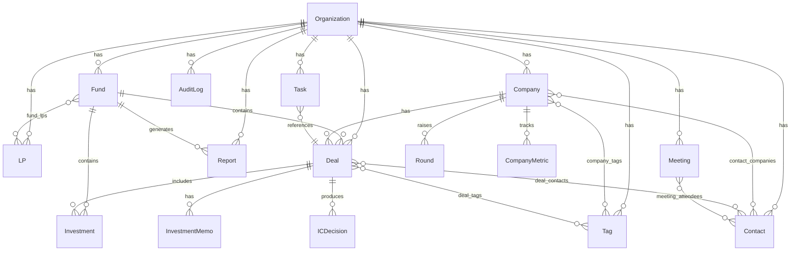

# Core Data Model & API

## Overview

Design and implement the complete VentureMind database schema with 16 core entities using Drizzle ORM on Neon Postgres, Row-Level Security for multi-tenant isolation, pgvector for semantic search, REST API routes with Zod validation, and a repository-pattern data access layer. Includes seed script with demo data and 80%+ test coverage.

## Problem Statement

VentureMind's Foundation & Auth (Task 1) is complete. Every subsequent feature (Deal Flow, Portfolio, Contacts, Meetings, LP Portal, AI Memos) depends on a solid data layer. Without it, no other task can proceed.

## Proposed Solution

Build the data layer in 4 phases: Schema → RLS → API → Seed, with tests at each phase.

## Technical Approach

### Architecture

```
src/
  db/
    schema/                    # Drizzle schema definitions
      organization.ts
      fund.ts
      company.ts
      deal.ts
      round.ts
      investment.ts
      contact.ts
      lp.ts
      investment-memo.ts
      company-metric.ts
      report.ts
      meeting.ts
      task.ts
      ic-decision.ts
      tag.ts
      audit-log.ts
      junctions.ts            # All junction tables
      enums.ts                # Shared enum definitions
      index.ts                # Re-export all schemas
    migrations/                # Generated by drizzle-kit
    seed.ts                    # Seed script
    client.ts                  # Neon + Drizzle client singleton
    types.ts                   # Branded ID types
  lib/
    api/
      envelope.ts              # { success, data, error, meta } helper
      pagination.ts            # Pagination helpers
      validation.ts            # Zod middleware wrapper
    repositories/
      base.ts                  # BaseRepository with CRUD
      deal.repository.ts
      company.repository.ts
      contact.repository.ts
      fund.repository.ts
      investment.repository.ts
      lp.repository.ts
      memo.repository.ts
      meeting.repository.ts
      # ... (one per entity)
  app/api/v1/
    deals/route.ts             # GET (list), POST (create)
    deals/[id]/route.ts        # GET, PUT, DELETE
    companies/route.ts
    companies/[id]/route.ts
    contacts/route.ts
    contacts/[id]/route.ts
    funds/route.ts
    funds/[id]/route.ts
    # ... (routes for all entities)
    search/route.ts            # Semantic search via pgvector
```

### Implementation Phases

#### Phase 1: Schema & Database Setup (Core)

**Tasks:**
1. Install dependencies: `drizzle-orm`, `@neondatabase/serverless`, `drizzle-kit`, `drizzle-zod`
2. Create `src/db/client.ts` — Neon serverless + Drizzle client with connection pooling
3. Define all 16 entity schemas in `src/db/schema/` with:
   - UUID primary keys (crypto.randomUUID)
   - Branded ID types for type safety: `type DealId = string & { __brand: 'DealId' }`
   - Proper foreign keys with `onDelete` cascades
   - `created_at`, `updated_at` timestamps on all tables
   - `org_id` on all tenant-scoped tables
4. Define shared enums in `src/db/schema/enums.ts`
5. Define 6 junction tables in `src/db/schema/junctions.ts`
6. Enable pgvector extension, add `vector(1536)` columns on Company + Contact
7. Generate and apply migrations via `drizzle-kit generate` + `drizzle-kit migrate`

**Entities with full column specs (from spec):**

| Entity | Key Columns | Notes |
|--------|------------|-------|
| Organization | clerk_org_id, name, slug, plan, settings(jsonb) | Root tenant |
| Fund | org_id, name, vintage_year, target_size_usd, status | Belongs to org |
| Company | org_id, name, sector, stage, embedding(vector), website, description | pgvector |
| Deal | org_id, fund_id, company_id, stage, ai_score(jsonb), priority, source | Core entity |
| Round | company_id, round_type, pre_money_valuation_usd, amount_raised_usd, status | Fundraising |
| Investment | fund_id, deal_id, company_id, amount_usd, ownership_pct, instrument | Transactions |
| Contact | org_id, first_name, last_name, email, type, embedding(vector), bio | pgvector |
| LP | org_id, name, type, committed_capital_usd, contact_id | Limited partner |
| InvestmentMemo | deal_id, org_id, title, status, content(jsonb), template_id | AI-generated |
| CompanyMetric | company_id, metric_name, value, period, source | Time-series |
| Report | org_id, fund_id, type, status, content(jsonb), published_at | LP reports |
| Meeting | org_id, title, date, type, summary(text), action_items(jsonb) | Notes |
| Task | org_id, title, assignee_id, status, priority, due_date, deal_id | Task mgmt |
| ICDecision | deal_id, org_id, decision, conditions(jsonb), vote_deadline | IC votes |
| Tag | org_id, name, color, category | Tagging system |
| AuditLog | org_id, actor_id, action, entity_type, entity_id, changes(jsonb) | Audit trail |

**Junction Tables:**

| Table | Columns | Purpose |
|-------|---------|---------|
| deal_tags | deal_id, tag_id | M:N deals-tags |
| company_tags | company_id, tag_id | M:N companies-tags |
| contact_companies | contact_id, company_id, role, is_primary | Contact-company |
| fund_lps | fund_id, lp_id, committed_amount, commitment_date | LP commitments |
| meeting_attendees | meeting_id, contact_id | Meeting participants |
| deal_contacts | deal_id, contact_id, role | Deal contacts |

**Success criteria:**
- `npx drizzle-kit generate` produces clean migrations
- TypeScript compiles with no errors
- All 16 tables + 6 junction tables defined

**Tests (Phase 1):**
- Schema type tests: verify all fields have correct types
- Branded ID type tests: verify type safety prevents mixing IDs

#### Phase 2: Row-Level Security

**Tasks:**
1. Create custom migration SQL for RLS policies
2. Add RLS policy on every table with `org_id`:
   ```sql
   ALTER TABLE companies ENABLE ROW LEVEL SECURITY;
   CREATE POLICY tenant_isolation_companies ON companies
     USING (org_id = current_setting('app.current_org_id')::uuid);
   ```
3. Create helper `setTenantContext(orgId: string)` that sets `app.current_org_id` on the connection
4. Apply RLS to: Fund, Company, Deal, Round, Investment, Contact, LP, InvestmentMemo, CompanyMetric, Report, Meeting, Task, ICDecision, Tag, AuditLog (15 tables, all except Organization)
5. Create a service role bypass for migrations and seed scripts

**Tests (Phase 2) — CRITICAL for reviewer:**
- Test that Org A cannot read Org B's data
- Test that setting tenant context correctly filters results
- Test that INSERT without correct org_id fails
- Test that service role bypasses RLS for admin operations

#### Phase 3: Repository Pattern & API Routes

**Tasks:**
1. Create `BaseRepository<T>` with standard CRUD:
   - `findAll(orgId, { page, limit, sort, filter })` → paginated results
   - `findById(orgId, id)` → single entity or null
   - `create(orgId, data)` → created entity
   - `update(orgId, id, data)` → updated entity
   - `delete(orgId, id)` → void
2. Implement specific repositories extending Base for each entity
3. Create `src/lib/api/envelope.ts`:
   ```typescript
   export function ok<T>(data: T, meta?: PaginationMeta): ApiResponse<T>
   export function error(message: string, code: string, status: number): ApiResponse<never>
   ```
4. Create Zod validation schemas for all entity inputs (create + update)
5. Build REST API routes for all entities under `/api/v1/`:
   - `GET /api/v1/deals` → list with pagination, filtering
   - `POST /api/v1/deals` → create with Zod validation
   - `GET /api/v1/deals/[id]` → get by ID
   - `PUT /api/v1/deals/[id]` → update with Zod validation
   - `DELETE /api/v1/deals/[id]` → soft delete or hard delete
6. Add Clerk auth check to all API routes
7. Extract org_id from Clerk session for tenant scoping
8. Add semantic search endpoint: `GET /api/v1/search?q=fintech&type=company`

**Response Envelope:**
```typescript
type ApiResponse<T> =
  | { success: true; data: T; meta?: { total: number; page: number; limit: number; hasMore: boolean } }
  | { success: false; error: string; code: string };
```

**Query Parameters:** `?page=1&limit=20&sort=created_at&order=desc&search=fintech&filter[stage]=series_a`

**Tests (Phase 3) — 80%+ coverage target:**
- Repository unit tests with mocked DB client for each method
- API route integration tests verifying:
  - Correct envelope format on success and error
  - Zod validation rejects invalid input with proper error messages
  - Auth check returns 401 for unauthenticated requests
  - Pagination meta is correct
  - Filtering and sorting work

#### Phase 4: Seed Script & Final Verification

**Tasks:**
1. Create `src/db/seed.ts` that generates:
   - 2 organizations with Clerk-compatible org IDs
   - 3 funds (2 in org1, 1 in org2)
   - 50 companies across both orgs (varied sectors/stages)
   - 80 deals across funds at different stages
   - 200 contacts with roles and company associations
   - 10 LPs with fund commitments
   - 20 meetings with attendees
   - 30 tasks assigned to various deals
   - 50 tags with deal/company associations
   - Sample audit log entries
2. Add `npm run db:seed` script
3. Add `npm run db:migrate` script
4. Add `npm run db:generate` script
5. Verify seed runs cleanly on fresh database

**Tests (Phase 4):**
- Seed script validation test: verify generated data counts match expectations
- End-to-end: migrate → seed → query → verify counts

## System-Wide Impact

### Interaction Graph

- Clerk auth → API routes extract org_id from session → Repository sets tenant context → DB executes with RLS filter
- All future features (Deal Flow, Portfolio, Contacts, etc.) depend on this data layer

### Error Propagation

- DB connection failures → Repository throws → API route catches → returns `{ success: false, error, code }` envelope
- Zod validation errors → caught at route level → returns 400 with field-level errors
- RLS violations → Postgres returns empty result set (not error) — this is by design

### State Lifecycle Risks

- Partial seed failure: use transaction wrapping to ensure atomicity
- Migration failures: Drizzle migrations are idempotent, can re-run safely
- Orphaned records: foreign key constraints with proper cascade rules prevent this

### API Surface Parity

- All 16 entities follow identical CRUD pattern via BaseRepository
- All routes follow identical envelope format
- All Zod schemas follow identical create/update pattern

## Acceptance Criteria

### Functional Requirements

- [ ] All 16 entity schemas defined with Drizzle ORM
- [ ] 6 junction tables defined with composite keys
- [ ] pgvector extension enabled, embedding columns on Company + Contact
- [ ] Migrations run cleanly on fresh Neon database
- [ ] RLS policies on all org-scoped tables (15 tables)
- [ ] RLS isolation verified with tests (Org A cannot see Org B data)
- [ ] Repository pattern: BaseRepository + entity-specific repos
- [ ] REST API routes for all entities with CRUD operations
- [ ] Zod input validation on all create/update endpoints
- [ ] API response envelope format: `{ success, data, error, meta }`
- [ ] Semantic search endpoint via pgvector cosine similarity
- [ ] Seed script: 2 orgs, 3 funds, 50 companies, 200 contacts
- [ ] Branded ID types prevent mixing entity IDs

### Non-Functional Requirements

- [ ] API responses < 200ms (list) / < 100ms (detail)
- [ ] Type-safe queries via Drizzle — no `any` types

### Quality Gates

- [ ] **80%+ test coverage on repository layer** (vitest --coverage)
- [ ] All tests pass (`npm run test`)
- [ ] Build passes (`npm run build`)
- [ ] No TypeScript errors
- [ ] ESLint passes

## Dependencies & Prerequisites

- **Neon Postgres**: Need database URL (use `DATABASE_URL` env var, skip validation for tests)
- **Drizzle ORM**: `drizzle-orm` + `@neondatabase/serverless` + `drizzle-kit`
- **pgvector**: Neon has pgvector enabled by default
- **vitest**: Already configured from Task 1
- **@vitest/coverage-v8**: Need to install for coverage reporting

## Risk Analysis & Mitigation

| Risk | Likelihood | Impact | Mitigation |
|------|-----------|--------|------------|
| No actual Neon DB for testing | High | High | Use mocked DB client for unit tests; test schema types statically |
| RLS tests need real DB | High | High | Write RLS policy SQL as migration, test logic via unit tests on helper functions |
| 80%+ coverage hard to reach | Medium | High | Focus repository layer tests, use vitest coverage-v8 |
| Reviewer rejects for missing tests | High | High | Write tests FIRST for each phase, verify coverage before submitting |

## Implementation Notes

### Drizzle Schema Pattern (per entity)

```typescript
// src/db/schema/company.ts
import { pgTable, uuid, varchar, timestamp, jsonb } from 'drizzle-orm/pg-core';
import { vector } from 'drizzle-orm/pg-core'; // pgvector
import { organizations } from './organization';
import { companyStageEnum } from './enums';

export const companies = pgTable('companies', {
  id: uuid('id').primaryKey().defaultRandom(),
  orgId: uuid('org_id').notNull().references(() => organizations.id, { onDelete: 'cascade' }),
  name: varchar('name', { length: 255 }).notNull(),
  sector: varchar('sector', { length: 100 }),
  stage: companyStageEnum('stage'),
  website: varchar('website', { length: 500 }),
  description: text('description'),
  embedding: vector('embedding', { dimensions: 1536 }),
  archivedAt: timestamp('archived_at', { withTimezone: true }),
  createdAt: timestamp('created_at', { withTimezone: true }).notNull().defaultNow(),
  updatedAt: timestamp('updated_at', { withTimezone: true }).notNull().defaultNow(),
});
```

### Repository Pattern

```typescript
// src/lib/repositories/base.ts
export abstract class BaseRepository<TTable, TInsert, TSelect> {
  constructor(protected db: DrizzleClient, protected table: TTable) {}

  async findAll(orgId: string, opts: QueryOptions): Promise<PaginatedResult<TSelect>> { ... }
  async findById(orgId: string, id: string): Promise<TSelect | null> { ... }
  async create(orgId: string, data: TInsert): Promise<TSelect> { ... }
  async update(orgId: string, id: string, data: Partial<TInsert>): Promise<TSelect> { ... }
  async delete(orgId: string, id: string): Promise<void> { ... }
}
```

### API Route Pattern

```typescript
// src/app/api/v1/deals/route.ts
import { auth } from '@clerk/nextjs/server';
import { dealRepository } from '@/lib/repositories/deal.repository';
import { createDealSchema } from '@/db/schema/validations';
import { ok, error } from '@/lib/api/envelope';

export async function GET(req: Request) {
  const { userId, orgId } = await auth();
  if (!userId || !orgId) return error('Unauthorized', 'UNAUTHORIZED', 401);

  const { searchParams } = new URL(req.url);
  const page = Number(searchParams.get('page') ?? 1);
  const limit = Number(searchParams.get('limit') ?? 20);

  const result = await dealRepository.findAll(orgId, { page, limit });
  return ok(result.data, result.meta);
}
```

## ERD Diagram



## Sources & References

### Internal References
- Spec document: `/home/timou/repos/wltest/output/venturemind-specs-complete.md` (Spec 2, lines 101-238)
- Task card: `/home/timou/repos/wltest/output/task-cards/card-02-data-model-api.md`
- Existing auth system: `src/lib/auth/roles.ts`, `src/lib/auth/guards.ts`
- Existing test setup: `vitest.config.ts`, `src/lib/auth/__tests__/`

### External References
- Drizzle ORM docs: https://orm.drizzle.team/docs/overview
- Neon serverless driver: https://neon.tech/docs/serverless/serverless-driver
- pgvector with Drizzle: https://orm.drizzle.team/docs/extensions/pg#pg_vector
- Drizzle Zod integration: https://orm.drizzle.team/docs/zod

### Twig Loop
- Task ID: `48f02f3a-7054-4083-aa61-26f612931e71`
- Canonical repo: `https://github.com/UncleTIM-GZ/venturemind`
- Branch: `feat/twigloop-48f02f3a`
- EWU: 6.50
